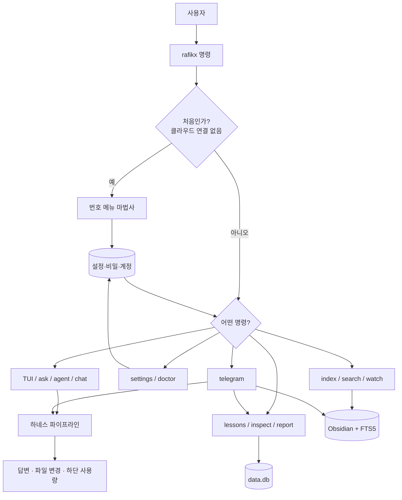
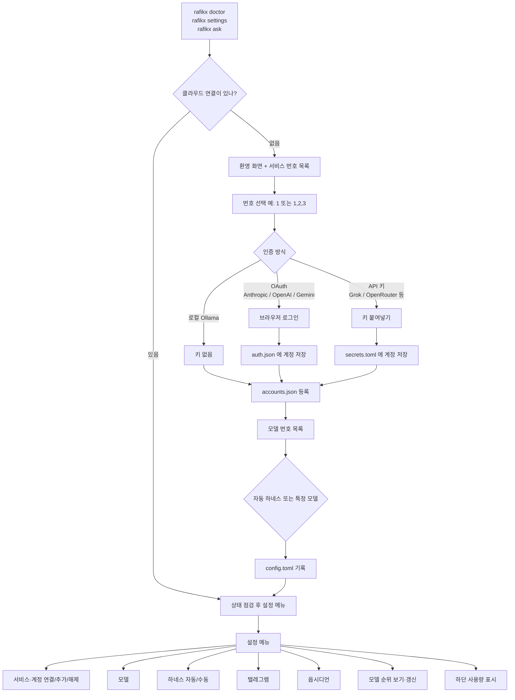
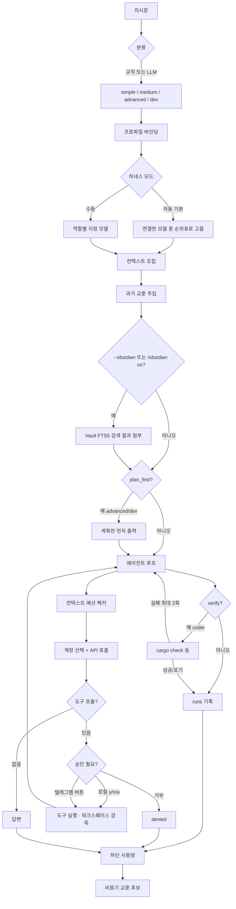
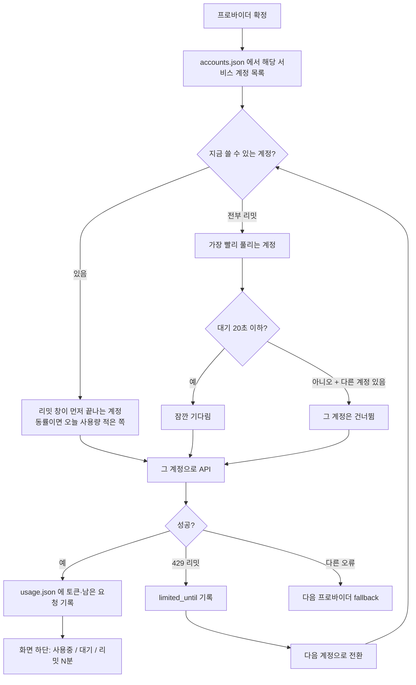
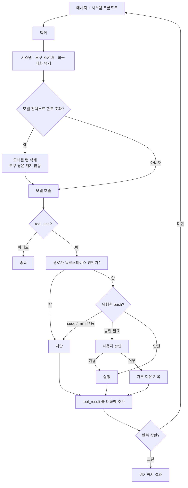
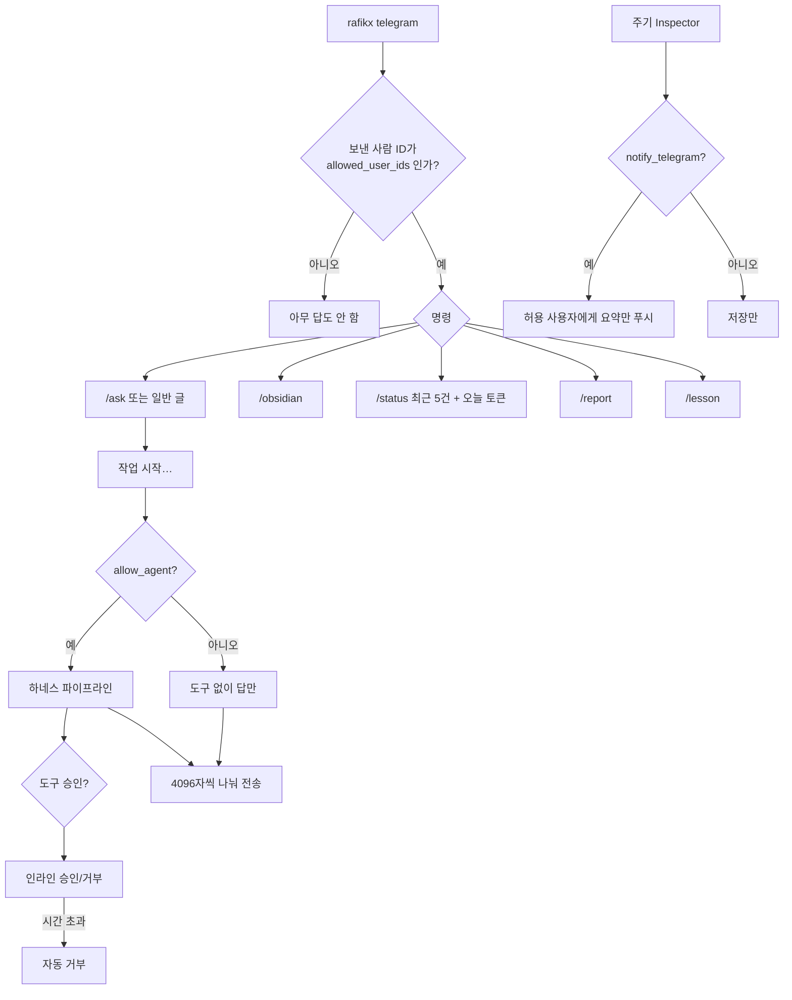
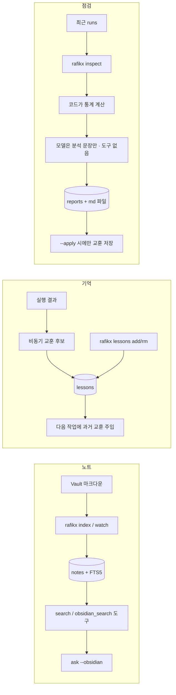
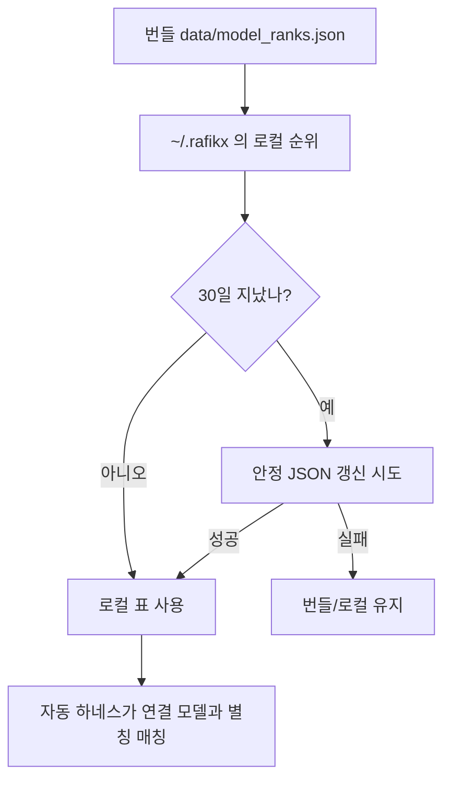

# RafikX 전체 워크플로

이 문서는 지금까지 설계·구현된 **RafikX**의 실행 흐름을 한곳에 모은 것입니다.  
명령 이름은 `rafikx` 입니다. 설정 폴더는 `%USERPROFILE%\.rafikx\` (예전 `.agent-harness`만 있으면 그쪽을 그대로 씁니다).

---

## 1. 한눈에 보는 전체 그림



---

## 2. 설치 후 첫 실행 · 설정

연결이 없으면 `rafikx` / `ask` / `chat` / `doctor`가 **번호 메뉴**를 엽니다. 서비스·모델 이름은 타이핑하지 않습니다. 키와 봇 토큰만 붙여넣습니다.



같은 서비스에 계정을 더 넣을 때: **설정 → 서비스·계정 → 같은 서비스에 계정 하나 더**.

---

## 3. 질문·작업의 중심 흐름 (`ask` / `agent` / `chat`)

`agent`는 `ask`와 같고, 분류를 강제로 `dev`로 둡니다.  
`chat`은 같은 파이프라인을 반복하며 세션을 저장합니다.



### 분류 → 프로파일

| 분류 | 프로파일 | 쓰는 때 | 도구 | 계획 | 검증 |
| --- | --- | --- | --- | --- | --- |
| simple | quick | 짧은 질문 | 없음 | 아니오 | 아니오 |
| medium | worker | 요약·검색·노트 | 읽기·검색 | 아니오 | 아니오 |
| advanced | thinker | 설계·구성 | 읽기+쓰기 | 예 | 아니오 |
| dev | coder | 코딩·디버깅·검증 | 전체 | 예 | 예 |

자동 모드에서 설계·구성·검증·디버깅은 **이미 연결한 모델 안**에서 추론 순위가 높은 것을 고릅니다. 상위권이 없으면 등록분 중 가장 나은 것을 씁니다. 연결하지 않은 서비스는 호출하지 않습니다.

---

## 4. 계정 선택 · 리밋 자동 전환



원격 텔레그램에서는 `--yes`(무조건 승인)가 **코드에서 금지**됩니다.

---

## 5. 에이전트 루프와 안전장치



Inspector(점검)는 **코드를 자동으로 고치지 않습니다.** 리포트와 교훈 제안만 합니다. `--apply`를 켜야 제안 교훈이 저장됩니다.

---

## 6. 텔레그램



`--with-watch`를 주면 Vault 감시(index)를 같이 켭니다.

---

## 7. 노트 · 교훈 · 점검



---

## 8. 모델 순위 (월 1회)



웹페이지 HTML을 긁지 않습니다. 설정 메뉴의 **지금 갱신** 또는 `rafikx ranks update`로 수동 갱신할 수 있습니다.

---

## 9. 데이터가 모이는 곳

```text
%USERPROFILE%\.rafikx\
  config.toml      모델·워크스페이스·텔레그램 (키 원문 금지)
  secrets.toml     API 키 · 봇 토큰
  auth.json        OAuth 토큰 (계정별)
  accounts.json    같은 서비스의 여러 계정
  usage.json       오늘 토큰 · 리밋 시각
  data.db          실행 이력 · 노트 검색 · 교훈 · 리포트
  reports\         점검 마크다운
  logs\agent.log   동작 기록 (키·토큰 없음)
```

---

## 10. 명령과 흐름 매핑

| 명령 | 들어가는 흐름 |
| --- | --- |
| `rafikx settings` | 2. 설정 메뉴 |
| `rafikx doctor` | 상태 점검 → 2. 설정 메뉴 |
| `rafikx ask "…"` | 3. 하네스 파이프라인 |
| `rafikx agent "…"` | 3. 파이프라인 (분류 고정 `dev`) |
| `rafikx` | 3. TTY 대화 TUI (파이프면 사용법) |
| `rafikx chat` | 3. 같은 TUI · 세션 저장 |
| `rafikx telegram` | 6. 텔레그램 → 3. 파이프라인 |
| `rafikx index` / `search` / `watch` | 7. 노트 |
| `rafikx lessons …` | 7. 교훈 |
| `rafikx inspect` / `report last` | 7. 점검 |
| `rafikx ranks` | 8. 순위 |

---

*이 문서는 구현 기준 스냅샷입니다. 동작이 바뀌면 이 파일도 같이 고치면 됩니다.*
