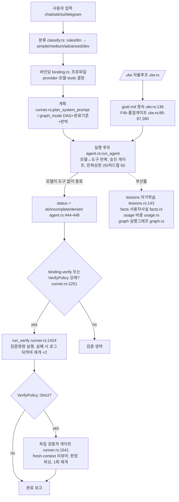

# 01 — 현재 상태 감사 (Phase 1)

> 작성일: 2026-08-29 · 대상: RafikX agent-harness (Rust) · 기준 커밋: v1.1.5 (fd75c2e)
> 모든 서술은 코드 근거(파일:라인)를 동반한다. 읽지 않고 쓴 서술은 없다.

## 1. 인벤토리

| 항목 | 값 | 근거 |
|---|---|---|
| 저장소 | `/Users/noah/RafikX` (git, master) | `git log` |
| 크레이트 | `agent-harness/` 단일 크레이트 (rafikx), desktop 은 Tauri 껍데기 | `agent-harness/Cargo.toml:2` |
| 진입점 | `agent-harness/src/main.rs:220` (`#[tokio::main]`, clap 서브커맨드) | main.rs |
| 핵심 모듈 | agent(루프) 1227줄, harness/(분류·바인딩·러너) 1691+494+약2500줄, ulw(자율루프) 757줄, self_harness 1222줄, inspector 697줄, lessons 282줄, db 1767줄, provider/(어댑터) | `wc -l` 실측 |
| 설정 | `~/.rafikx/config.toml` (providers·harness·edit·ui·inspector 섹션) | config.rs:308(CustomFile 파서), DEFAULT_CONFIG |
| 로그 | `~/.rafikx/logs/{debug,ops,agent}.log` JSONL | applog.rs, 로그 파일 실재 확인 |
| 의존성 | reqwest, tokio, ratatui, rusqlite, teloxide, clap, serde, similar(diff), syntect | Cargo.toml |
| 문서 | SPEC.md, AGENT_HARNESS_SPEC_v3(docx), docs/HARNESS_V2_DESIGN.md, docs/PERFORMANCE.md | 저장소 루트 |

## 2. 아키텍처 맵 (실제 데이터 흐름)

## 3. 모델 호출 지점 전수 조사

| # | 호출 지점 | 목적 | 시스템 프롬프트 | 실패 처리 |
|---|---|---|---|---|
| 1 | `agent.rs:run_agent` 루프 | 태스크 실행 본체 | `harness/runner.rs:6 system_prompt()` (RFC2119+워크플로+전달계약+[언어정책]) | 반복 상한, 동일호출 3회 차단(agent.rs:40), 폴백 체인 |
| 2 | `harness/runner.rs:588` 계획 호출 | 계획/완료기준/반박 생성 | `plan_system_prompt` (runner.rs:230 전후, [계획][완료 기준][반박] 섹션 강제) | 스트리밍, 실패 시 비계획 진행 |
| 3 | `harness/runner.rs:1512` 검증 재개 | 검증 실패修复 | 동일 system + 오류 되먹임 | 2회 상한 → verify_fail |
| 4 | `harness/runner.rs:1700+` 독립 검증자 | 판정 ([판정] pass/fail) | review_prompt(runner.rs:1702) — 원작업+완료기준+반박+변경파일, diff 미첨부(직접 읽게 함) | 판정불능 1회 재질의 → AcceptUnknown |
| 5 | `harness/runner.rs:1802,1849` critic 노드 | 계획 반박(그래프 모드) | [반박] 섹션 지시(runner.rs:241) | 실패 시 게이트 입력 없음 |
| 6 | `lessons.rs:192` 반성 호출 | 교훈 추출 (JSON 1개) | 고정 프롬프트 | 실패 무음 스킵 |
| 7 | `inspector.rs:16` 진단 호출 | 통계 분석 리포트 | "코드가 계산한 사실… 재계산 금지" | 리포트 전용(판정권 없음) |
| 8 | `self_harness.rs:524` Harness 수정 제안 | 자기개선 루프 | JSON 패치 지시 | 회귀 검증 후 승격(self_harness.rs:720 수락규칙) |
| 9 | `harness/classify.rs` llm 분류기 | 난이도 분류 | 한 단어 분류 | rules 폴백 |

공통 파싱: 텍스트 + 섹션 마커(`[판정]`, `[완료 기준]`, `[반박]`) 파싱이 주력. 구조화 출력 강제(스키마 검증+재시도)는 lessons/self_harness 의 JSON 파싱이 전부이고 재시도 루프는 없음(실패 시 스킵).

## 4. 핵심 질문에 대한 답 (코드 기준)

### Q1. "태스크가 완료됐다"는 판정은 누가, 무엇으로 내리는가?
**1차 판정은 모델이다.** `agent.rs:444-448` — 모델이 도구 호출 없이 종료(StopReason != ToolUse)하면 `status = "ok"`. 즉 "완료"의 첫 신호는 모델의 종료 행동이다.
**2차 완충은 시스템이지만 선택적이다.** `runner.rs:1251-1258` — `binding.verify`가 켜인 프로파일이거나 `VerifyPolicy`(Auto/Strict)일 때만 `run_verify`가 검증 명령을 직접 실행한다. 검증 명령은 `binding.verify_command` 또는 자동 감지인데 **자동 감지는 Rust면 `cargo check`뿐이다**(`runner.rs:2482-2485` — 테스트가 아니라 컴파일만 확인).
**Strict 모드에서만 독립 판정이 붙는다.** `runner.rs:1541+` — fresh-context 리뷰어가 `[판정]`을 내고, fail이면 1회 재개. 단 `Indeterminate`(판정 불능)는 재질의 1회 후 **`AcceptUnknown`으로 통과 처리**된다(`runner.rs:gate_action`) — "판정 불능 = 완료" 경로가 존재한다.
**ULW(자율루프)는 예외적으로 강하다.** `ulw.rs:86-97, 260-335` — 코드 변경이 있으면 ulw가 직접 검증을 돌려 `verify_ok=false`면 어떤 완료 기준도 충족 처리하지 않고(`ulw.rs:301-303`), `all_done = all_met && verify_passed`(`ulw.rs:335`).

### Q2. 파일을 수정하지 않고 "완료했다"고 주장하면 잡히는가?
**부분적으로만.** `run_verify`는 changed_files가 비어도 검증을 생략하지 않고 명령을 돌린다(수정 없음 자체는 차단 안 함). 다만 `runner.rs:1255`의 조건 `outcome.status != "incomplete"`와 ULW의 `verify_ran`(코드 변경 없음·감지 명령 없으면 검증 생략, ulw.rs:87-88) 때문에 "수정 0 + 검증 명령 없음" 조합은 **그냥 완료로 지나간다**. diff 부재를 완료 차단 사유로 보는 코드는 없다. (근거: `grep -n "changed_files.is_empty" harness/ ulw.rs` — diff 부재 차단 로직 부재 확인)

### Q3. 테스트 삭제 / `#[ignore]` 추가를 잡는가?
**아니다.** 테스트 파일 변경을 감지하는 코드가 존재하지 않는다. 도구 승인은 사용자에게 먼저 갈 뿐(yolo 모드에선 승인 자체가 없음), diff 후처리로 어서션 약화·테스트 삭제·ignore 추가를 검사하는 로직은 전무 (`grep -rn "ignore\|어서션" agent.rs harness/ tools/ — 편집 앵커 해시 관련 외 없음). 유일한 안전판은 사용자 승인과 mutation 롤백(`tools/mutation/commit.rs:142` — 적용 실패 시 파일 원복, git 기반이 아님).

### Q4. 모호한 요청에 질문하는가?
**시스템 장치는 없고 프롬프트 기대에만 의존한다.** 시스템 프롬프트의 [의도 게이트](runner.rs:42-45)가 "모호하면 맥락으로 해석 가능한 한 결정하고, 남은 분기점만 짧게 물어본다"고 지시하지만, 이는 모델의 자율에 맡겨진 것이며 질문 루프·승인 게이트·동결 장치는 코드에 없다. 분류기(classify.rs)는 난이도만 판단한다.

### Q5. 계획은 파일로 영속화되는가?
**ULW만 그렇다.** `ulw.rs:115,136` — `/ulw`는 `goal.md`(목표+완료기준)와 `state.json`을 디렉터리에 쓰고 재개(`/ulw-resume`)된다. 일반 ask/chat·task 위임의 계획은 컨텍스트 안에만 존재하고 파일로 남지 않는다. 세션이 끊기면 일반 경로의 계획은 유실된다. PROGRESS.md는 사람이 수동 관리하는 3줄 요약일 뿐 에이전트가 읽는 상태가 아니다(AGENTS.md 관례).

### Q6. Inspector는 격리돼 있는가, 판정권이 있는가?
**격리는 되어 있으나 판정권은 없다.** `inspector.rs:16` 프롬프트가 "코드가 계산한 사실만" 다루며 별도 호출(별도 컨텍스트)이고, 출력은 리포트/텔레그램 전달뿐이다(anomaly.rs는 알림). Inspector가 상태 전이(DONE 판정)에 관여하는 코드는 없다. 검증 판정권은 Strict 게이트의 리뷰어(`runner.rs`)와 ULW 품질 게이트(`ulw.rs`)가 별도로 갖고 있다 — 즉 "판정하는 조직"과 "진단하는 조직"이 분산돼 있다.

### Q7. 스펙 문서(v2/v3)와 구현의 차이
| 스펙에 있으나 미구현/약함 | 근거 |
|---|---|
| 스펙 인터뷰·SPEC 동결 절차 | 코드에 질문 루프 없음(Q4) |
| 태스크 스키마·의존성 그래프 기반 실행 | 계획은 텍스트/DAG 표시용(graph.rs), 실행 순서 결정에 쓰이지 않음 |
| 증거 원장(evidence ledger) | runs 테이블(db.rs)에 요약만 저장, 명령별 exit code 원장 없음 |
| 테스트 무결성 가드 | 미구현(Q3) |
| 모델 보정 스위트 | 미구현 (provider 어댑터만 존재) |
| git 체크포인트/태스크 커밋 | mutation 롤백만 있음(commit.rs:142), git 스냅샷 없음 |
| 구현됐으나 스펙에 가깝게 동작하는 것 | 독립 검증자 게이트(Strict), ULW 품질 게이트, 계획 [반박] 비평, lessons 중복 방지(db FTS) |

## 5. 강점 요약 (감사 관점)

1. **provider 어댑터**는 이미 설정만으로 교체 가능(`provider/` 모듈, fallback 체인) — 축 4-1은 기반 탄탄.
2. **독립 검증자 게이트**가 fresh-context·diff 미첨부(직접 읽게 강제)라는 올바른 설계 원칙으로 존재(runner.rs:1702 주석 명시).
3. **ULW 품질 게이트**는 "검증 실패 시 어떤 기준도 충족 처리 금지"(ulw.rs:301)라는 시스템 강제가 이미 구현돼 있다.
4. **승인 게이트·경로 감옥·위험 명령 차단**(tools.rs:resolve_in_workspace, bash_blocked)이 도구 계층에 있다.
5. **관측성 뼈대**(JSONL 로그, runs/usage/graph)가 있어 원장 확장의 접착면이 좋다.

## 6. 약점 요약 (Phase 3 입력)

1. 완료 1차 신호가 모델 종료 행동(agent.rs:448) — 시스템 강제는 조건부(bindings/verify_policy).
2. 자동 검증 명령이 `cargo check`뿐(runner.rs:2484) — 테스트 미실행이 기본값.
3. 판정 불능 시 통과(AcceptUnknown, runner.rs:gate_action).
4. 테스트 무결성 가드 전무, diff 부재 차단 전무.
5. SPEC/계획/증거의 파일 영속화가 ULW에만 존재 — 일반 경로 재개 불가.
6. 인터뷰·승인·동결 절차 없음 — 모호성 처리가 프롬프트 기대에 의존.
